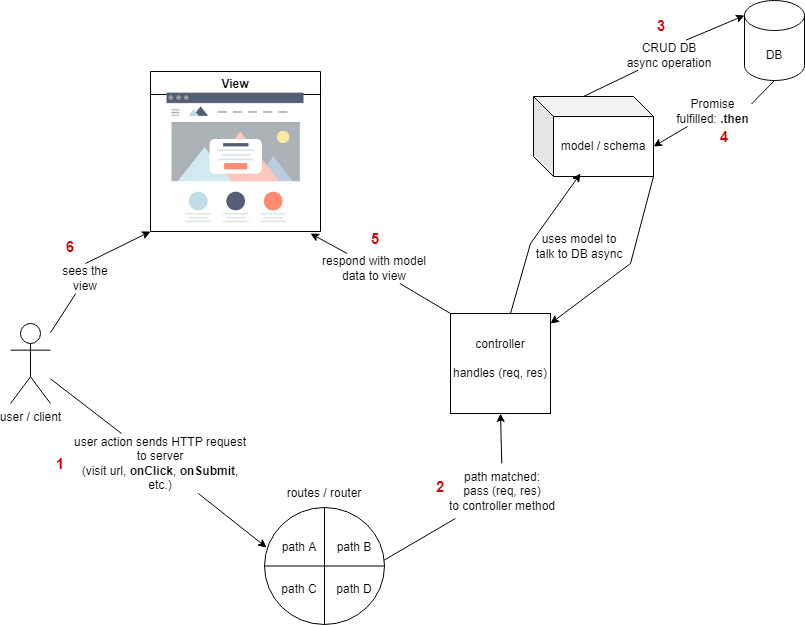
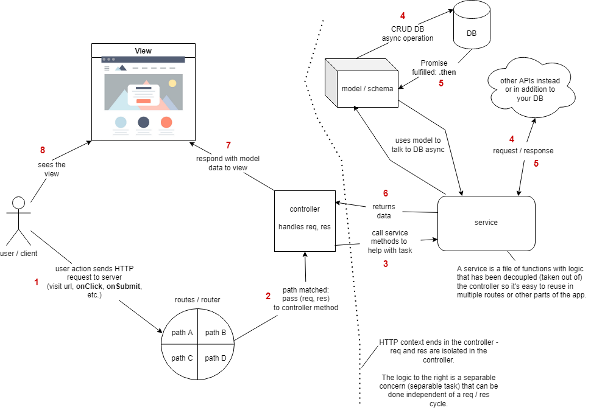

# Example full-stack react project structure

This project serves as an example of how to structure a full-stack react project with an explanation of the choices made below.

## Folder structure

### src folders

`src` folders are a per app, package, or lib convention to help organize and separate _source code_ files from all the configuration files that quickly add up and could clutter your code files if not separated.

In this case, we have three `src` folders, one for our project as a whole to separate the two apps from the top-level config files, then one in each app `client` and `api` to separate each app's code files from their own configuration files.

### index files

Index files have a few advantages:

1. Clarity and privacy: the `index.js` specifies what code from the folder is available to be imported from outside the folder (clear distinction between public vs internal code)
   - Some code may be intended only for use within the folder and therefore should not be exported / imported
1. Consistency: imports don't need to specify any file other than the `index.js`
1. DRY: everything that can be imported from a folder is available in a single import statement since the `index.js` collects and exports everything
   - Depending on how the project is configured, you may not even need to explicitly refer to the `index.js` because it will be automatically searched for if only the folder name is used (such as in create-react-app)

## Named vs default imports / exports

Named imports and exports are used wherever possible instead of defaults to provide consistency.

Many popular packages use default imports, so they are fine to use. However, it can be a bit confusing when there are multiple ways to import the same code and when the chosen name for the import can be anything.

You can only have one default export per file, and when importing it, you can choose any name for it which can make it harder to search the codebase to find all the places that particular code is imported.

Named imports must specify the exact name of the export and you can have as many named exports as needed. You can still rename a named import, but only after explicitly referencing the name.

### ES6 modules enabled

Our back-end doesn't already come with webpack and babel configured like create-react-app does, so those would need to be setup in order to use `import` and `export` in the back-end in the same way they are used in the front-end.

However, a simpler alternative is to add `"type": "module"` to [src/api/package.json](./src/api/package.json). With this added, we can use `import` and `export` with the below caveats:

- `require` is no longer available
- must add `.js` in `from './fileName.js'`
- must specify `from 'folder/index.js` instead of it automatically finding the folder's `index.js`
- must load `dotenv` differently so the env vars are available before other modules are loaded (see [./src/api/src/main.js](./src/api/src/main.js))
- must use `assert` to import JSON files: `import json from './foo.json' assert { type: 'json' };`

## utils

`utils` is just a folder name convention to follow separation of concerns and decouple logic to make code more reusable, usually in the form of small helper functions and classes.

In react, [utils](./src/client/src/utils/) is code that isn't a component or a hook, but multiple components may need to utilize it.

## services

`services` is another folder name convention to follow separation of concerns and decouple logic to make code more reusable. Services are usually more specifically focused around decoupling API and database logic.

In our react front-end, [internalApiService](./src/client/src/services/internalApiService.js) contains all the api call logic that can be reused in any component that needs to make an api call to our own back-end.

Our backend [services](./src/api/src/services) contains all the database logic so it can be easily reused in multiple controller handlers / routes if needed.

The below images diagram what adding a service layer to the back-end MVC looks like:

## assets

The `assets` folder is for storing static assets, such as images.

## Config files

### Node version

The [.nvmrc](./.nvmrc) is used with Node Version Manager (nvm) which you should use to make it easier to switch versions of node between projects. This file helps the `nvm use` command, when ran from the project's root folder, suggest the node version to use.

Additionally, the `"engines"` key can be used in `package.json` and a [.npmrc](./.npmrc) file can be used.
